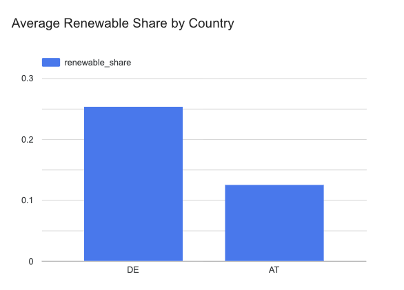
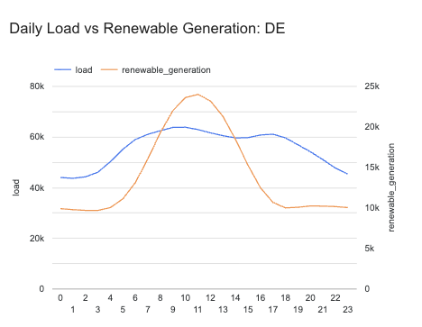
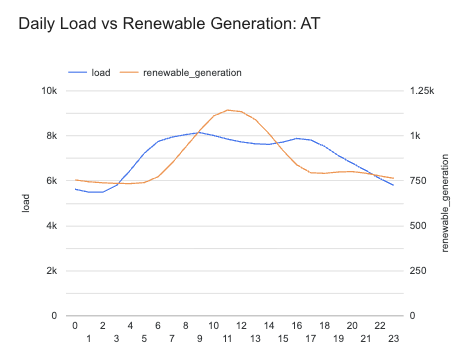

# Renewable Energy Data Pipeline

## 📌 Overview
This project builds an end-to-end data pipeline to process, clean, and analyze European electricity demand and renewable energy production data. The pipeline transforms raw, messy time-series data into structured datasets for analysis and visualization.

---

## 🎯 Goal
To design and implement a scalable data pipeline that enables analysis of how renewable energy (wind & solar) impacts electricity demand patterns across Europe.

---

## 🚀 Key Results

* Germany’s renewable share is **~2x higher** than Austria
* Germany’s electricity demand is **~8x larger** than Austria
* Peak demand occurs in the **morning (08:00–10:00)**
* Renewable generation peaks at **midday**, creating a **supply-demand mismatch**

This highlights a key challenge in energy systems: aligning renewable production with consumption patterns.

---

## 📚 Table of Contents

- [Overview](#-overview)  
- [Goal](#-goal)  
- [Problem Statement](#-problem-statement)  
- [Architecture](#-architecture)  
- [Tech Stack](#-tech-stack)  
- [Pipeline Steps](#-pipeline-steps)  
- [Project Structure](#-project-structure)  
- [Expected Output](#-expected-output)  
- [Future Improvements](#-future-improvements)  

---

## ❓ Problem Statement
This project aims to answer:

- How does electricity demand vary over time?
- What share of energy comes from renewable sources?
- When do peak demand periods occur?
- How clean and reliable is real-world energy data?

---

## 🏗️ Architecture
The pipeline follows a modern data engineering architecture with clear separation of responsibilities between orchestration, storage, and transformation layers:

```text
External Data Source (CSV)
        ↓
Airflow (Ingestion & Orchestration)
        ↓
Google Cloud Storage (Raw Layer)
        ↓
BigQuery (Raw Tables)
        ↓
dbt (Transformations)
        ↓
BigQuery (Analytics Tables)
        ↓
Looker Studio (Visualization)
```


---

## ⚙️ Tech Stack

- **Orchestration:** Apache Airflow  
- **Programming Language:** Python (Pandas)  
- **Data Lake:** Google Cloud Storage (GCS)  
- **Data Warehouse:** BigQuery  
- **Transformation:** dbt  
- **Containerization:** Docker  
- **Infrastructure as Code:** Terraform  
- **Visualization:** Looker Studio  

---

## 🔄 Pipeline Steps

1. **Ingestion**
   - Download raw energy dataset
   - Store in GCS (data lake)

2. **Transformation**
   - Clean missing values
   - Standardize timestamps
   - Select relevant features (demand, wind, solar)
   - Create new features (hour, day, renewable share)

3. **Storage**
   - Load cleaned CSV into BigQuery

4. **Analysis**
   - Aggregate daily metrics
   - Identify peak demand periods
   - Compare renewable vs total energy

5. **Visualization**
   - Build dashboard in Looker Studio

---

## 📂 Project Structure
```text
renewable-energy-pipeline/
│
├── airflow/
│   └── dags/
│       └── energy_pipeline.py          # Main Airflow DAG
│
├── dbt/
│   └── energy_project/
│       ├── models/
│       │   ├── staging/
│       │   │   └── stg_energy.sql      # Cleaned raw data
│       │   └── marts/
│       │       └── energy_metrics.sql  # Aggregated metrics
│       │
│       ├── seeds/                      # Optional static data
│       ├── tests/                      # dbt tests
│       ├── dbt_project.yml
│       └── profiles.yml
│
├── src/
│   ├── ingest.py                       # Data download logic
│   ├── validate.py                     # Data validation checks
│   └── utils.py                        # Helper functions
│
├── terraform/
│   ├── main.tf                         # GCP resources (GCS, BigQuery)
│   └── variables.tf
│
├── docker/
│   └── Dockerfile                      # Custom container (optional)
│
├── notebooks/
│   └── exploration.ipynb               # EDA (not part of pipeline)
│
├── docker-compose.yaml                 # Orchestration (Airflow, dbt, etc.)
├── requirements.txt                    # Python dependencies
├── .env                                # Environment variables (not committed)
└── README.md
```
---

## 📊 Expected Output

- Cleaned datasets  
- Aggregated energy metrics  
- BigQuery tables  
- Dashboard  

---

## 📊 Data Exploration & Insights

After building the pipeline, the data is available in BigQuery and can be queried using SQL.

### 🔎 Example Queries

**1. Average Renewable Share by Country**

```sql
select
  country,
  avg(renewable_share) as avg_renewable_share
from energy_pipeline_dataset.energy_metrics
group by country
order by avg_renewable_share desc;
```

### 🔍 Renewable Energy Comparison

Germany shows a significantly higher reliance on renewable energy compared to Austria.

* Germany: ~25% of total load covered by renewables
* Austria: ~12% of total load covered by renewables

This indicates that Germany's energy system is more dependent on renewable sources such as wind and solar.

---

**2. Energy Demand Comparison**

```sql
select
  country,
  avg(load) as avg_load
from energy_pipeline_dataset.energy_metrics
group by country
```

### ⚡ Energy Demand Comparison

Germany's electricity demand is substantially higher than Austria's.

* Germany: ~55,000 average load
* Austria: ~7,000 average load

This represents nearly an 8x difference, reflecting the scale of Germany's energy consumption and infrastructure.

---

**3. Peak Load Periods**

```sql
select
  extract(hour from utc_timestamp) as hour,
  avg(load) as avg_load
from energy_pipeline_dataset.energy_metrics
group by hour
order by hour
```

### ⏱️ Daily Demand Patterns

Electricity demand exhibits a consistent daily cycle:

* **Nighttime (00:00–04:00):** Lowest demand levels
* **Morning (05:00–10:00):** Rapid increase, peaking around 09:00–10:00
* **Midday (11:00–15:00):** Gradual decline in demand
* **Late Afternoon (16:00–18:00):** Secondary increase
* **Evening/Night (19:00–23:00):** Steady decrease

This pattern reflects human activity cycles, including residential usage in the morning and industrial/commercial demand throughout the day.

---

## 📈 Visual Analysis

The following charts provide a visual representation of energy demand patterns and renewable generation behavior across countries.

### 🌱 Renewable Energy Share by Country



### ⚡ Germany: Demand vs Renewable Generation



### ⚡ Austria: Demand vs Renewable Generation



### 🔍 Cross-Country Comparison

Both Germany and Austria demonstrate similar daily energy patterns:

* Demand peaks in the **morning**
* Renewable generation peaks at **midday**

However, key differences exist:

* Germany operates at a much larger scale of consumption
* Austria shows a relatively closer alignment between renewable supply and demand
* In both countries, renewable generation does not fully coincide with peak demand

## 🧠 Conclusion

This project demonstrates how modern data engineering tools can be used to transform raw energy data into actionable insights.

The analysis reveals a structural challenge in renewable energy systems:
while renewable generation is increasing, it does not yet fully align with peak demand periods.

This highlights the importance of:

* energy storage solutions
* flexible grid systems
* diversified energy sources

The pipeline provides a scalable foundation for further energy analytics and real-time monitoring.
