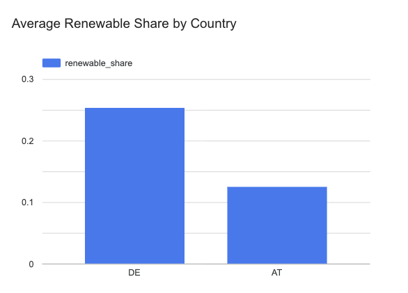
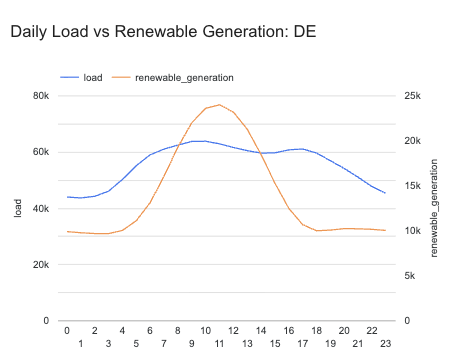
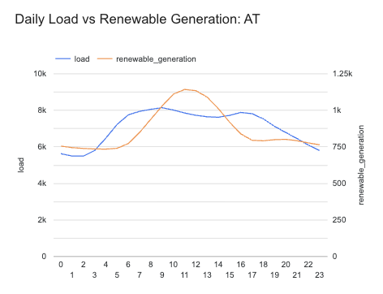

# Renewable Energy Data Pipeline

Python | Airflow | dbt | BigQuery | Terraform | Docker | GCP

Production-style ELT pipeline processing European energy data with Airflow, GCP, BigQuery, dbt, Docker, Terraform.

<a id="overview"></a>
## 📌 Overview
This project builds an end-to-end data pipeline to process, clean, and analyze European electricity demand and renewable energy production data. The pipeline transforms raw, messy time-series data into structured datasets for analysis and visualization.

---

<a id="goal"></a>
## 🎯 Goal
To design and implement a scalable data pipeline that enables analysis of how renewable energy (wind & solar) impacts electricity demand patterns across Europe.

---

## 🚀 Key Results

* Germany’s renewable share is **~2x higher** than Austria
* Germany’s electricity demand is **~8x larger** than Austria
* Peak demand occurs in the **morning (08:00–10:00)**
* Renewable generation peaks at **midday**, creating a **supply-demand mismatch**

This highlights a key challenge in energy systems: aligning renewable production with consumption patterns.

---

## 📚 Table of Contents

- [Overview](#overview)  
- [Goal](#goal)  
- [Problem Statement](#problem-statement)  
- [Architecture](#architecture)  
- [Data Modeling](#data-modeling)  
- [Tech Stack](#tech-stack)  
- [Pipeline Steps](#pipeline-steps)  
- [Reproducibility](#reproducibility)
- [Dashboard](#dashboard)
- [Project Structure](#project-structure)  
- [Data Exploration & Insights](#data-exploration-insights)
- [Conclusion](#conclusion)  

---

<a id="problem-statement"></a>
## ❓ Problem Statement
This project aims to answer:

- How does electricity demand vary over time?
- What share of energy comes from renewable sources?
- When do peak demand periods occur?
- How clean and reliable is real-world energy data?

---

<a id="architecture"></a>
## 🏗️ Architecture
The pipeline follows a modern data engineering architecture with clear separation of responsibilities between orchestration, storage, transformation, and visualization layers.

```text
External Data Source (CSV)
        ↓
Airflow (Ingestion & Orchestration)
        ↓
Google Cloud Storage (Raw Layer)
        ↓
BigQuery (Raw Tables)
        ↓
dbt (Transformations)
        ↓
BigQuery (Analytics Tables)
        ↓
Looker Studio (Visualization)
```

---

<a id="data-modeling"></a>
## 🧩 Data Modeling (Partitioning & Clustering)

To optimize query performance and reduce costs in BigQuery, tables are designed using partitioning and clustering strategies aligned with common query patterns.

### 📅 Partitioning

The main table (`energy_clean`) is partitioned by:

- `utc_timestamp` (daily partitioning)

**Why?**

- Most queries filter data by time ranges (e.g. daily, hourly analysis)
- Partitioning ensures only relevant data is scanned
- Reduces query cost and improves performance

### 🔀 Clustering

The table is clustered by:

- `hour_of_day`
- `day_of_week`

**Why?**

- BigQuery does not support clustering on `FLOAT` energy-measure columns
- Time-based analysis is a core use case in this project
- Clustering by hour and weekday improves performance for repeated temporal aggregations

### 🎯 Result

This design enables:

- Efficient time-based filtering
- Faster aggregations on energy metrics
- Reduced data scanning and cost in BigQuery
---

<a id="tech-stack"></a>
## ⚙️ Tech Stack

- **Orchestration:** Apache Airflow  
- **Programming Language:** Python (Pandas)  
- **Data Lake:** Google Cloud Storage (GCS)  
- **Data Warehouse:** BigQuery  
- **Transformation:** dbt  
- **Containerization:** Docker  
- **Infrastructure as Code:** Terraform  
- **Visualization:** Looker Studio  

---

<a id="pipeline-steps"></a>
## 🔄 Pipeline Steps

1. **Ingestion**
   - Download raw energy dataset
   - Store in GCS (data lake)

2. **Transformation**
   - Clean missing values
   - Standardize timestamps
   - Select relevant features (demand, wind, solar)
   - Create clustering-friendly time features (`hour_of_day`, `day_of_week`)

3. **Storage**
   - Load cleaned CSV into BigQuery using batch upload

4. **Analysis**
   - Aggregate daily metrics
   - Identify peak demand periods
   - Compare renewable vs total energy

5. **Visualization**
   - Build dashboard in Looker Studio

---

<a id="reproducibility"></a>
## 🔁 Reproducibility

This section explains how to run the project from scratch and reproduce the pipeline locally.

### Prerequisites

- Docker and Docker Compose
- A Google Cloud project
- Terraform
- Google Cloud SDK (gcloud)

### Quick Start
1. Authenticate
2. Terraform apply
3. docker compose up
4. Trigger DAG
5. dbt run

### 1. Clone the repository

```bash
git clone <your-repo-url>
cd renewable-energy-pipeline
```

### 2. Authenticate with Google Cloud

This project mounts your local Google credentials into the Airflow container automatically:

```bash
gcloud auth application-default login 
gcloud config set project YOUR_PROJECT_ID
```

### 3. Provision infrastructure with Terraform

This project uses Terraform as Infrastructure as Code to provision the required cloud resources:

```bash
cd terraform
cp terraform.tfvars.example terraform.tfvars
terraform init
terraform apply
cd ..
```

Terraform creates:

- GCS bucket: `energy-pipeline-bucket`
- BigQuery dataset: `energy_pipeline_dataset`

If you want to use different names, update terraform.tfvars and the Airflow Variables:

- `gcp_bucket`
- `gcp_project`
- `bq_dataset`

### 4. Start Airflow with Docker

```bash
docker compose up -d
```

Airflow UI will be available at:

```text
http://localhost:8080
```

Default login:

- Username: `admin`
- Password: `admin`

### 5. Trigger the pipeline

In the Airflow UI:

1. Open the DAG `renewable_energy_pipeline`
2. Turn the DAG on
3. Trigger a run manually

The DAG will:

- Download the OPSD time series dataset
- Clean and validate the data
- Upload the cleaned CSV to GCS
- Load the cleaned data into BigQuery using batch processing (not streaming)

If you change the raw BigQuery table definition, for example partitioning or clustering fields, delete the existing `energy_clean` table before rerunning the DAG so BigQuery can recreate it with the new layout.

### 6. Run dbt models

After the raw table is loaded into BigQuery, configure your local dbt BigQuery profile, then run the models from the dbt project directory.

Your local dbt profile should point to the same:

- GCP project
- BigQuery dataset
- authentication method used for your Google credentials

Then run:

```bash
cd dbt/energy_project
dbt run
dbt test
```

### 7. Reproduce the analysis

Once the pipeline and dbt models finish successfully, you can:

- Query the mart tables in BigQuery
- Recreate the SQL analyses shown below
- Rebuild the charts in `images/`

### Notes

- The Airflow DAG is defined in `airflow/dags/energy_pipeline.py`
- The Docker setup is intentionally minimal and currently runs Airflow in standalone mode
- The raw BigQuery table is partitioned by `utc_timestamp` and clustered by `hour_of_day` and `day_of_week`
- A valid dbt BigQuery profile is required to run the dbt models locally
- The project depends on access to Google Cloud resources; without valid credentials, GCS and BigQuery tasks will fail

---

<a id="dashboard"></a>
## 📋 Dashboard

The final analytics layer is designed for dashboarding in Looker Studio.

The dashboard contains multiple visual tiles, including:

- renewable share comparison by country
- Germany demand vs renewable generation
- Austria demand vs renewable generation

## Live Dashboard
[View Dashboard](https://lookerstudio.google.com/reporting/f24296a9-7663-40e4-ba54-739a4ee1f5e8)

These views support the key analytical questions in the problem statement and go beyond a single-chart output.

### 🌱 Renewable Energy Share by Country



### ⚡ Germany: Demand vs Renewable Generation



### ⚡ Austria: Demand vs Renewable Generation



### 🔍 Cross-Country Comparison

Both Germany and Austria demonstrate similar daily energy patterns:

* Demand peaks in the **morning**
* Renewable generation peaks at **midday**

However, key differences exist:

* Germany operates at a much larger scale of consumption
* Austria shows a relatively closer alignment between renewable supply and demand
* In both countries, renewable generation does not fully coincide with peak demand

---

<a id="project-structure"></a>
## 📂 Project Structure
```text
renewable-energy-pipeline/
│
├── airflow/
│   └── dags/
│       └── energy_pipeline.py          # Main Airflow DAG
│
├── dbt/
│   └── energy_project/
│       ├── models/
│       │   ├── staging/
│       │   │   ├── stg_energy.sql      # Cleaned staging model
│       │   │   └── schema.yml
│       │   ├── intermediate/
│       │   │   └── energy_long.sql
│       │   └── marts/
│       │       ├── energy_daily.sql
│       │       └── energy_metrics.sql  # Aggregated metrics
│
│       ├── dbt_project.yml
│       └── tests/                      # Custom dbt data tests
│      
├── src/
│   ├── ingest.py                       # Data download logic
│
├── terraform/
│   ├── main.tf                         # GCP resources (GCS, BigQuery)
│   ├── terraform.tfvars
│   └── variables.tf
│
├── docker/
│   └── Dockerfile                      # Custom container (optional)
│
├── notebooks/
│   └── exploration.ipynb               # EDA (not part of pipeline)
│
├── docker-compose.yaml                 # Orchestration (Airflow, dbt, etc.)
├── .env                                # Local environment variables
└── README.md
```
---

<a id="data-exploration-insights"></a>
## 📊 Data Exploration & Insights

After building the pipeline, the data is available in BigQuery and can be queried using SQL.

### 🔎 Example Queries

**1. Average Renewable Share by Country**

```sql
select
  country,
  avg(renewable_share) as avg_renewable_share
from energy_pipeline_dataset.energy_metrics
group by country
order by avg_renewable_share desc;
```

### 🔍 Renewable Energy Comparison

Germany shows a significantly higher reliance on renewable energy compared to Austria.

* Germany: ~25% of total load covered by renewables
* Austria: ~12% of total load covered by renewables

This indicates that Germany's energy system is more dependent on renewable sources such as wind and solar.

---

**2. Energy Demand Comparison**

```sql
select
  country,
  avg(load) as avg_load
from energy_pipeline_dataset.energy_metrics
group by country
```

### ⚡ Energy Demand Comparison

Germany's electricity demand is substantially higher than Austria's.

* Germany: ~55,000 average load
* Austria: ~7,000 average load

This represents nearly an 8x difference, reflecting the scale of Germany's energy consumption and infrastructure.

---

**3. Peak Load Periods**

```sql
select
  extract(hour from utc_timestamp) as hour,
  avg(load) as avg_load
from energy_pipeline_dataset.energy_metrics
group by hour
order by hour
```

### ⏱️ Daily Demand Patterns

Electricity demand exhibits a consistent daily cycle:

* **Nighttime (00:00–04:00):** Lowest demand levels
* **Morning (05:00–10:00):** Rapid increase, peaking around 09:00–10:00
* **Midday (11:00–15:00):** Gradual decline in demand
* **Late Afternoon (16:00–18:00):** Secondary increase
* **Evening/Night (19:00–23:00):** Steady decrease

This pattern reflects human activity cycles, including residential usage in the morning and industrial/commercial demand throughout the day.

---

### ✅ Data Quality Findings

The project also addresses the question of how clean and reliable the source data is.

- Rows with invalid or missing timestamps are removed during ingestion
- Completely empty columns are dropped before loading to BigQuery
- Airflow validation checks ensure the dataset is not empty and that timestamps are present
- dbt tests validate model grain, accepted values, non-negative energy values, and calculation consistency

These checks do not guarantee perfect source data, but they provide confidence that the transformed dataset is structurally consistent and analytically usable.

---

<a id="conclusion"></a>
## 🧠 Conclusion

This project demonstrates how modern data engineering tools can be used to transform raw energy data into actionable insights.

The analysis reveals a structural challenge in renewable energy systems:
while renewable generation is increasing, it does not yet fully align with peak demand periods.

This highlights the importance of:

* energy storage solutions
* flexible grid systems
* diversified energy sources

The pipeline provides a scalable foundation for further energy analytics and real-time monitoring.
